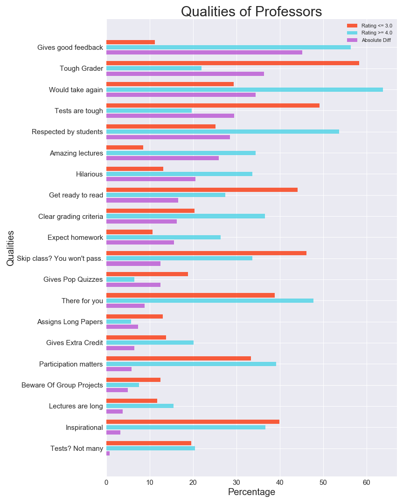
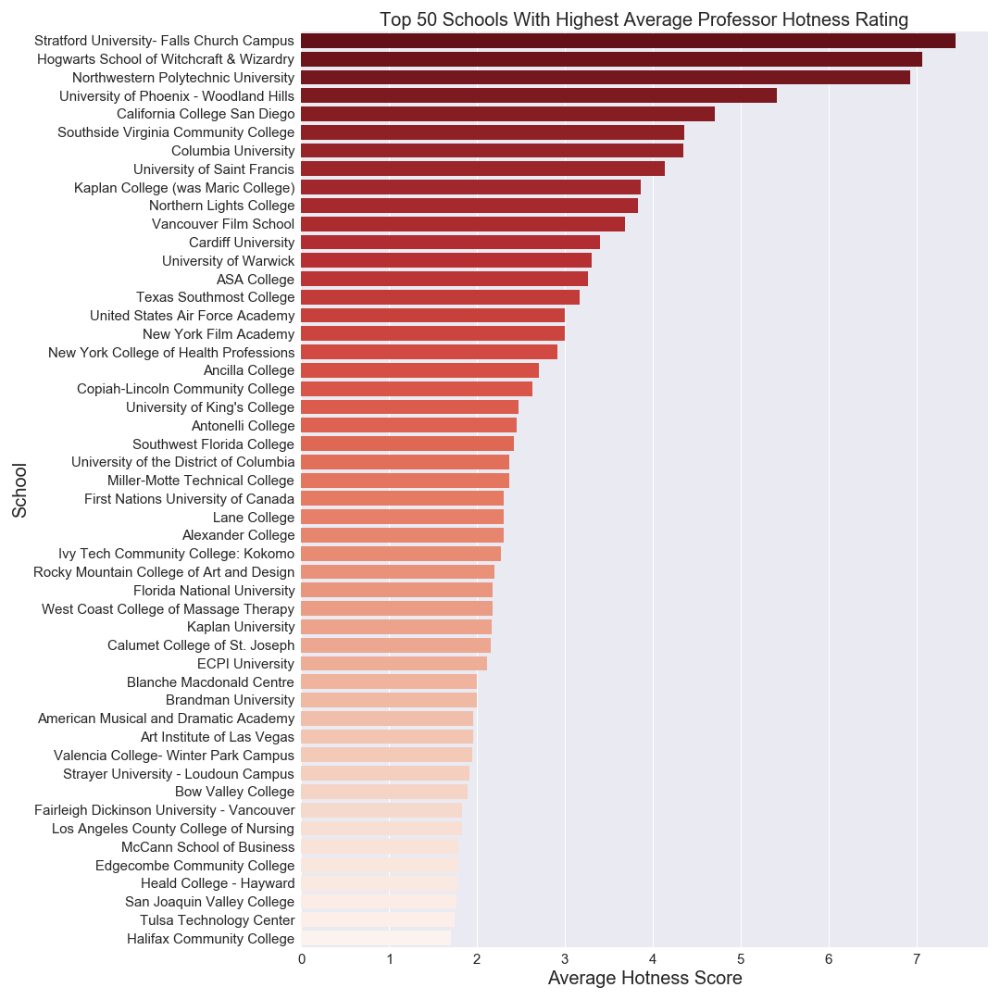

# Rate-My-Professor-Analysis
Analysis of Rate My Professor

Data originally from a reddit.com/r/datasets, but user who uploaded has deleted the post and removed dataset from kaggle. 
If you are that user, please let me know so I can properly credit you.

If you are unfamiliar with Ratemyprofessor.com, it's like yelp for professors and schools. It's mostly used to rate universities and professors, but it does include some high school teachers. This dataset includes 17 json files containing information about professor rating, 'hotness', clarity, qualities, etc.

Most ratings are on a scale of 1-5, excluding 'hotness'. Users can also add premade tags, such as 'inspirational', 'beware of pop quizzes', and 'test heavy'.

Let's take a look at what qualities (the premade tags) separate a good professor from a 'bad' professor.

Here, we'll consider "good" professors as ones with an average rating of 4 or higher, and the 'bad' professors as ones with an average rating of 3 or lower. Anything in between is considered average.

We see that the biggest quality disparity is "gives good feedback"; over 55% of good professors and a little over 10% of bad professors have this quality. On the opposite end, the quality that nearly both good and bad professors share almost equally is "Tests? Not many", sitting at around 20%. 

What else can be noticed here? It seems that qualities that measure likeablilty and personality ("Amazing Lectures", "Would Take Again", "Respected By Students", etc.) see the highest disparity between good and bad professors. On the other hand, qualities that measure workload ("Beware Of Group Projects", "Lectures Are Long", etc.) appear less often for both good and bad professors, and see a smaller disparity. So if you're a professor who's trying to increase your average rating, try being more likeable (easier said than done). Giving less tests and quizzes wouldn't hurt, either.

__NEXT__

