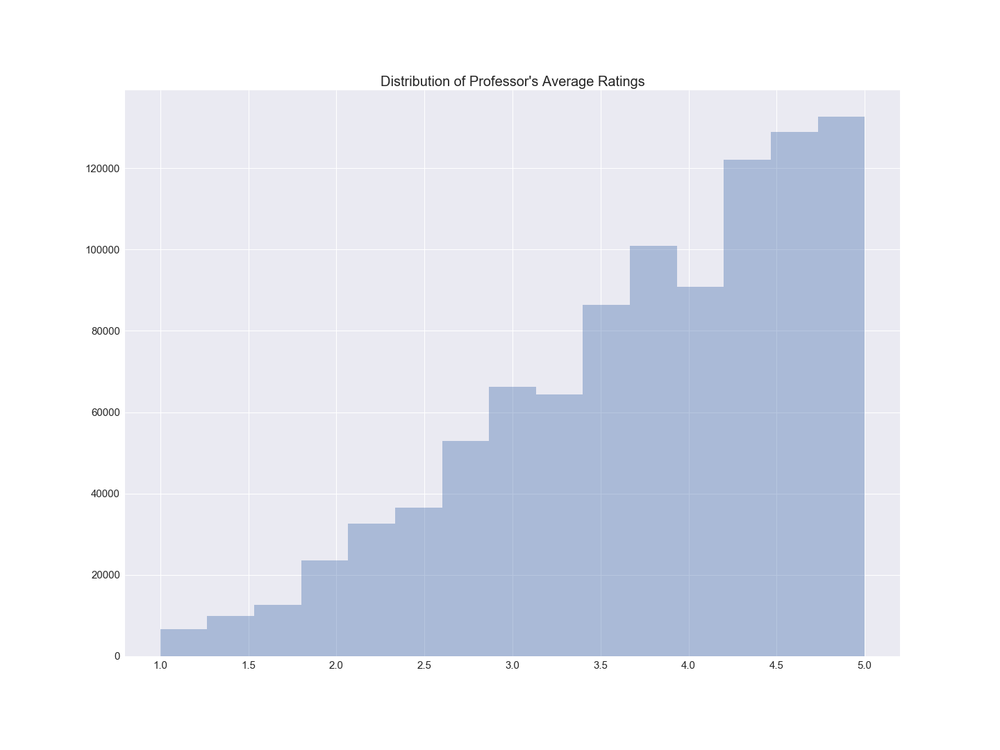
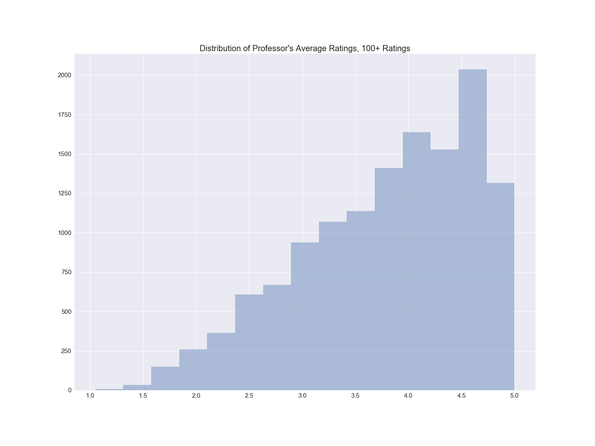

Analysis of Rate My Professor

Data originally from a reddit.com/r/datasets, but user who uploaded has deleted the post and removed dataset from kaggle. If you are that user, please let me know so I can properly credit you.

If you are unfamiliar with Ratemyprofessor.com, it's like yelp for professors and schools. It's mostly used to rate universities and professors, but it does include some high school teachers. This dataset includes 17 json files containing information about professor rating, 'hotness', clarity, qualities, etc.

Most ratings are on a scale of 1-5, excluding 'hotness'. Users can also add premade tags, such as 'inspirational', 'beware of pop quizzes', and 'test heavy'.

Let's take a look at what qualities (the premade tags) separate a good professor from a 'bad' professor.

Here, we'll consider "good" professors as ones with an average rating of 4 or higher, and the 'bad' professors as ones with an average rating of 3 or lower. Anything in between is considered average.

We see that the biggest quality disparity is "gives good feedback"; over 55% of good professors and a little over 10% of bad professors have this quality. On the opposite end, the quality that nearly both good and bad professors share almost equally is "Tests? Not many", sitting at around 20%.

What else can be noticed here? It seems that qualities that measure likeablilty and personality ("Amazing Lectures", "Would Take Again", "Respected By Students", etc.) see the highest disparity between good and bad professors. On the other hand, qualities that measure workload ("Beware Of Group Projects", "Lectures Are Long", etc.) appear less often for both good and bad professors, and see a smaller disparity. So if you're a professor who's trying to increase your average rating, try being more likeable (easier said than done). Giving less tests and quizzes wouldn't hurt, either.

__Distribution of ALL Average Ratings__

Negative skewed. It seems most professors have pretty good scores, with a significant amount of professors with 4.25 or higher. One thing to consider is the number of ratings in this graph; professors with as little as 4 ratings or as much as 2000 ratings are measured here. Keep in mind a professor with more ratings has more variance among their average rating scores. Next, we'll look at the distribution of scores for professors with 100+ ratings.

__Distribution of Average Ratings, 100+ Ratings

Notice that once the ratings increased, the number of average ratings of 5 significantly decreased, relative to the frequency of other scores. Meanwhile, the largest group is the one step below. Once again, the more ratings a professor has, the harder it is for them to maintain that high average rating.

__Hot Schools and Hotter Professors__

Which schools have the 'hottest' professors?

We excluded schools with less than 10 professor ratings. Hottest here is, of course, subjective. The definition here can be a little ambiguous, as it could represent physical attractiveness and/or popularity. Also, Hogwarts is number 2.

Now who are the overall hottest professors with at least 100 ratings?

.png)

Once again, hotness is subjective. You are free to Google Image and judge for yourself. Notice that the highest rating is almost 1000. I personally do not know how hotness ratings are accumulated on RMP. When rating a professor's hotness, you can choose yes or no, so one assumption can be that the scores are the sum of 1's and 0's. Notable names: Ted Moseby (How I Met Your Mother) and Severus Snape (Harry Potter)

